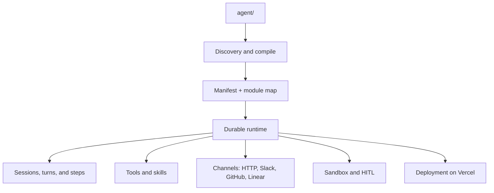

export const metadata = {
  title: 'Vercel Eve: durable agents for production',
  description:
    'Vercel Eve frames AI agents as durable backend services with file conventions, tools, skills, real channels, human review, and deployment.',
};

export const date = 'June 21, 2026';

> The problem with many agents is not that they cannot reason. It is that they do not live anywhere reliable.

An agent that only exists as a prompt, a local script, or a chat demo can work for five minutes. The hard part starts when it has to remember task state, wait for approval, call GitHub, survive a deploy, answer from Slack, and leave enough traces for someone to understand what it did.

That is where [Vercel Eve](https://vercel.com/eve) fits. The short thesis: **Eve points toward AI agents as durable, deployable backend applications connected to real channels, not just scripts or conversational demos**.

This is not a full installation guide. It is a technical read of Eve based on the official documentation, the open source repo, the Vercel Labs templates, and a practical experiment with [Reprokit](https://github.com/MarcosCamara01/reprokit).

## 1. What Vercel Eve is [#what-vercel-eve-is]

Eve is a filesystem-first framework for building AI agents as durable backend applications. The base idea is simple: an agent is a directory. Instead of hiding behavior inside one large code block or a long prompt chain, Eve uses file conventions under `agent/`.

On Vercel's landing page, that idea is summarized as "Markdown for instructions and skills, TypeScript for tools". The [Vercel Knowledge Base](https://vercel.com/kb/eve) and the [official `vercel/eve` repo](https://github.com/vercel/eve) reinforce the same point: agent capabilities live in conventional locations so the project is easier to inspect, extend, and operate.

In developer terms, Eve is not just another wrapper around a model call. It is a way to package agent behavior as an application.

That includes several pieces a team can review as code:

- `agent.ts` to choose the model and configure the runtime.
- `instructions.md` for persistent agent rules.
- `tools/` for TypeScript functions the model can call.
- `skills/` for Markdown procedures the agent can load on demand.
- `channels/` to connect the same agent to HTTP, Slack, GitHub, Discord, Linear, or other surfaces.
- `connections/` to reach external services through MCP or OpenAPI with managed auth.
- `sandbox/`, subagents, scheduled tasks, hooks, evaluations, and durable state for more demanding flows.

The difference from a classic chatbot is not cosmetic. A chatbot usually starts from the interface. Eve starts from behavior and from the infrastructure needed to run that behavior in a maintainable way. For teams, that turns an agent into something you can discuss in a pull request, not only something you can demo.

## 2. The problem Eve tries to solve [#the-problem-eve-tries-to-solve]

For a long time, building "an agent" has meant gluing together three things: a prompt, a model call, and an improvised tool. That pattern is fine for prototypes, but it breaks once the agent has to live beyond one HTTP request or one chat session.

Eve tries to move the center of gravity. The jump is not from "short prompt" to "longer prompt". It is from **prompt + API call** to **deployable agent system**.

The [official Eve introduction](https://vercel.com/blog/introducing-eve) talks about durable execution, isolated compute, human approvals, subagents, and evaluations. That list maps closely to the problems that show up when an agent touches production systems:

- It needs durability to pause and resume work without keeping compute active.
- It needs channels so it is not locked to one chat UI.
- It needs typed tools so actions are auditable and testable.
- It needs skills so all procedural knowledge does not end up in the base prompt.
- It needs human-in-the-loop approval for expensive, sensitive, or irreversible actions.
- It needs deployment and observability so the team can operate it.

It is worth being careful here. Vercel announced Eve as a public preview on June 17, 2026 in its [changelog](https://vercel.com/changelog/introducing-eve-an-open-source-agent-framework). The npm package I checked on June 21, 2026 is `eve@0.12.0` and requires Node `>=24`. That means the surface is still moving. For a real product, I would pin the version, read changelogs before upgrading, and cover critical flows with evaluations.

My read, after going through the docs and code, is that Eve is trying to do for agents something close to what web frameworks did for routes, compilation, data, and deployment: turn repeated architectural decisions into a conventional surface. A useful agent does not only fail because the model is wrong. It fails because you do not know which prompt version was active, which tool ran, whether the human approval came from the right person, or whether the same webhook message arrived twice.

Eve does not solve those problems automatically. What it does is give them an explicit place in the architecture. That changes the question from "what prompt should I use?" to "what operational contract does this agent have?".

## 3. The mental model [#the-mental-model]

The mental model that helps me most is this: Eve turns a file tree into an executable agent. You do not write a giant orchestration graph from scratch. You declare the agent pieces, and the runtime discovers, compiles, and connects them.

A minimal structure can look like this:

```text
agent/
├── agent.ts
├── instructions.md
├── tools/
│   └── get_weather.ts
├── skills/
│   └── investigate.md
├── channels/
│   └── slack.ts
├── connections/
│   └── linear.ts
├── subagents/
│   └── researcher/
└── schedules/
    └── monday_summary.ts
```

The convention is deliberate. A file in `tools/get_weather.ts` becomes a tool named `get_weather`. A skill in `skills/investigate.md` can be loaded when the model needs it. A channel in `channels/slack.ts` adapts Slack events to the same agent. `agent.ts` defines the model and runtime configuration.

That separation creates a useful boundary: instructions for stable behavior, tools for actions, skills for procedures, channels for input and output, and sandbox for isolated work. Once the agent grows, that boundary is more valuable than a longer prompt.

You can read the architecture like this:



The key piece is `sessions`, `turns`, and `steps`. According to Eve's technical docs, a session represents the durable conversation or task; a turn is the user message and the work it triggers; a step is a checkpoint inside that turn. If a step has already finished, Eve can reuse its result during replay. If it was interrupted halfway through, it can be re-executed. That is why actions with external effects need to be idempotent or gated behind approval.

This changes how you design agents. You no longer only think about "what should I tell the model?". You think about which parts are instructions, which parts are actions, which parts run in the sandbox, which channel starts the work, and which decisions require a person.

## 4. What the landing page does not show [#what-the-landing-page-does-not-show]

There is a useful reading of Eve that does not show up at first glance: **Eve does not only organize agents; it forces you to decide what kind of thing each part of the agent is**.

In a prototype, everything tends to blur together: instructions, permissions, execution, memory, business logic, API access, and human decisions. In Eve, a skill teaches a procedure or a team convention; a tool crosses the boundary into the outside world and calls an API, writes a file, comments on GitHub, or opens a PR. That distinction keeps "knowledge" and "capability" from becoming the same thing.

A channel is also more than a nice Slack or GitHub integration. It normalizes input, decides how responses are delivered, and keeps the `continuationToken` that lets the conversation or task continue. That token is not a durable FIFO queue. If you need deterministic ordering between messages, you have to wait for clear states, such as `session.waiting`, before continuing.

The failure model changes the design too. An operation that sends an email, charges money, deletes data, or opens a PR cannot be a casual `execute()` and done. It needs idempotency, approval, or a stable identifier.

Finally, there is the review surface. An Eve agent is a set of files that lets you answer concrete questions:

- What can it actually do?
- What persistent instructions does it have?
- Which actions require approval?
- Which secrets reach the runtime, and which never enter the sandbox?
- Which channel can start work, and with what auth?
- Which scheduled tasks exist?

That list is more useful than an abstract "safe agent" label. It gives you concrete audit points and pushes agents away from opaque conversations and toward reviewable software.

## 5. Where Eve may make sense [#where-eve-may-make-sense]

The official Vercel Labs templates give a good signal about the use cases Vercel has in mind. The [Slack agent template](https://github.com/vercel-labs/eve-slack-agent-template) covers a minimal agent with tools and skills; the [content agent template](https://github.com/vercel-labs/eve-content-agent-template) mixes Slack, Notion, and Vercel Blob; the [personal agent template](https://github.com/vercel-labs/personal-agent-template) combines web chat, Slack, iMessage, Linear, and user-approved memory; the [PR triage template](https://github.com/vercel-labs/eve-pr-triage-agent-template) connects GitHub and diffs; and the [chat template](https://github.com/vercel-labs/eve-chat-template) shows a persisted Next.js interface around Eve.

Some product shapes that fit this model:

1. Internal agents for teams that need to query systems like Linear, Notion, GitHub, or Datadog.
2. Support automation that investigates context, drafts a response, and waits for review.
3. Engineering agents that triage PRs, issues, incidents, or regressions.
4. Technical workflows where a person approves sensitive steps before execution.
5. Agent backends that serve a web UI, Slack, and webhooks without duplicating logic.

The value is not assuming the model will always be right. It is having places to inspect, limit, approve, test, and deploy the behavior when it is wrong. If you reduce agents to chat, you design around the interface. If you treat them as durable backends, you design around events, permissions, state, actions, and observability.

## 6. Costs, limits, and open questions [#costs-limits-and-open-questions]

The balanced read is this: Eve addresses real problems, but it does not turn an agent into a product by itself. It gives you structure and runtime; you still own the operational design.

Several costs should stay visible:

- **Maturity:** Eve is in public preview. APIs, docs, and contracts may change before the surface stabilizes. If you try it in something serious, pinning the version is not optional.
- **Platform dependency:** Eve naturally integrates with Vercel Workflow, Vercel Sandbox, AI Gateway, Vercel Connect, and Vercel observability. That can be an advantage if you already live in that ecosystem, but it also shapes architecture and deployment.
- **Initial complexity:** for a small automation, `agent/`, channels, tools, skills, sandbox, and evaluations may be too much. A script or a simple queue may be better.
- **Security is not automatic:** route auth is not the same as user, tenant, or session authorization. If multiple users access the same agent, you still need to design ownership and permissions.
- **Idempotency:** the durable runtime helps resume work, but it does not make your external effects idempotent. Sensitive tools still need defensive design.
- **Uneven channels:** not every channel has the same maturity, ergonomics, or configuration surface. GitHub, Slack, Linear, Discord, and Teams do not impose the same flows.

This matters because Eve should not be read as a closed solution. It is better understood as a base for building operable agents, with decisions still left to the team: what the model may execute, what requires approval, how each step is audited, what data enters the sandbox, and what happens when something fails.

There is also an open question about the balance between convention and flexibility. Conventions help as an agent grows, but they can feel heavy if the use case only needs one scheduled function or one isolated tool. My rule of thumb would be to reach for Eve when the agent already needs durability, channels, human review, or repeatable deployment. Not before.

## 7. Reprokit: my practical test [#reprokit-my-practical-test]

To test the idea, I built [Reprokit](https://github.com/MarcosCamara01/reprokit), a project oriented around GitHub issues. The short description is this: **Reprokit turns GitHub issues into verifiable reproductions, reviewed fixes, and PRs generated only after checks pass**.

Reprokit is not the main character of this article, but it helps ground Eve in a real use case. In Reprokit, `/repro`, `/fix`, `/fix codex`, `/fix claude`, `/compare`, and `/stop` live as issue commands or CLI commands. The agent uses tools to read issues, prepare an isolated checkout, run external workers, generate reports, run checks, and open PRs.

The important part is not that it "fixes bugs". It is the safety policy around the flow:

- `/repro` never modifies code, creates branches, or opens PRs.
- `/fix` requires an explicit human signal in the issue.
- There is no auto-merge or automatic deployment.
- Each run uses isolated checkouts under `.runs/issue-<number>/`.
- Logs are redacted before being published.
- PRs stay reviewable by humans.
- If Codex or Claude Code are not installed, the system falls back to clearly labeled mock workers.

Reprokit uses Eve as an orchestrator and, in parallel, keeps an independent webhook server for the simpler path. That dual mode was useful because it let me test the agent architecture without forcing everything through the Eve runtime from day one. It is also worth saying that the repo pins `eve@0.11.3`, while the latest npm version I checked on June 21, 2026 is `0.12.0`, so I treat it as a practical experiment, not as a showcase of the newest surface.

The transferable pattern is separating "orchestrating" from "doing the dangerous work". For real agents, the safer flow is often not "do the task", but:

1. understand the context;
2. prepare an isolated environment;
3. generate evidence;
4. request approval if something meaningful changes;
5. execute;
6. verify;
7. leave a reviewable artifact.

Eve offers a structure that fits that sequence because it separates instructions, tools, skills, channels, and durable state. Reprokit simply applies that pattern to GitHub bugs.

## 8. What I learned testing Eve [#what-i-learned-testing-eve]

My experience testing Eve reinforced three ideas. First: **file conventions help you reason about larger agents**. Keeping instructions, tools, skills, subagents, and channels separate makes the system reviewable without reading the whole repository.

Second: durability fits real agents, but it demands discipline. If a flow can pause, resume, or repeat an interrupted step, tools cannot be black boxes with unpredictable side effects. In Reprokit, that pushes small but important decisions: branch names like `agent/fix-issue-<n>`, issue-scoped checkouts, workers with structured output, and reports that can be regenerated from persisted data.

Third: channels change product design. An agent that can live in GitHub, Slack, HTTP, or a web UI stops being "a chat" and becomes a system capability. The central behavior stays in the same backend even when the entry point changes.

What is confirmed by official documentation: Eve has a durable runtime, TypeScript tools, Markdown skills, channels, connections, sandbox, subagents, scheduled tasks, and evaluations. What my test confirmed: those conventions are enough to structure a real GitHub issue, worker, and PR flow. What is still an inference: that Eve can become a standard building block for agent products. To support that read, we need API stability, production examples, and longer-term operational experience.

The main doubt is where the balance between convention and flexibility lands. In simple agents, this structure may feel heavy. In agents that touch GitHub, Slack, Linear, Notion, sandboxes, approvals, and multiple models, it starts to justify itself.

## 9. How to test the idea without overbuilding [#how-to-test-the-idea-without-overbuilding]

If you want to try Reprokit as an example, you do not need to start with a full deployment. Clone the repo, install dependencies, and run the basic checks:

```bash
git clone https://github.com/MarcosCamara01/reprokit.git
cd reprokit
npm install
npm run typecheck
npm test
```

To use the Eve mode with `npm run dev`, Reprokit needs `GEMINI_API_KEY` because the agent uses Gemini through `@ai-sdk/google`. For GitHub and webhooks, it also needs variables such as `GITHUB_TOKEN`, `GITHUB_OWNER`, `GITHUB_REPO`, `GITHUB_WEBHOOK_SECRET`, and a public HTTPS URL so GitHub can deliver events.

That split lets you test in layers: compilation, tests, parsers, reports, and policies first; then the real channel, GitHub webhook, and deployment. The point is not to adopt Reprokit as-is. It is to see the kind of architecture Eve encourages: agent behavior as a reviewable project, not a loose prompt.

## 10. Where this could go [#where-this-could-go]

The most relevant part of Eve is not that it simplifies day one. For a small demo, it may look like too much: folders, compilation, channels, runtime, auth, sandbox, and evaluations. The better question is what happens on day thirty, when the agent touches real data, receives messages through more than one entry point, and has to explain why it did something.

That is where Eve may be useful. A maintainable agent needs boundaries, state, typed tools, repeatable deployments, observability, security policy, and ways to ask for human help. Eve does not answer all of that for you; it offers a structure where those answers can live.

It is still early to know how this proposal will age across different teams, stricter security requirements, and version migrations. But the mental model is already useful: moving from "agents as conversations" to "agents as services". If that direction matures, Eve could become a reasonable option for moving from agent demos to maintainable agent products, not because it comes from Vercel, but because it forces the agent to behave like software that can be deployed, reviewed, observed, and constrained.

## Main sources [#main-sources]

- [Official Vercel Eve documentation](https://vercel.com/docs/eve)
- [Official Eve landing page](https://vercel.com/eve)
- [Official announcement: Introducing eve](https://vercel.com/blog/introducing-eve)
- [Vercel changelog: Eve in public preview](https://vercel.com/changelog/introducing-eve-an-open-source-agent-framework)
- [Official `vercel/eve` repo](https://github.com/vercel/eve)
- [Eve templates in the Vercel Knowledge Base](https://vercel.com/kb/eve)
- [Reprokit](https://github.com/MarcosCamara01/reprokit)
